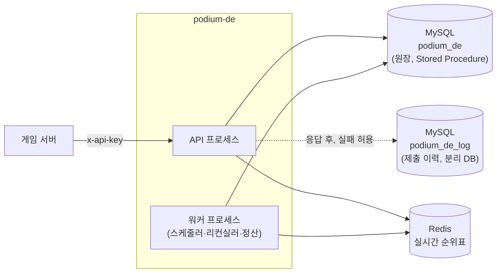

# podium-de (Podium DE)

> 게임 프로젝트에 시즌 기반 랭킹·정산·보상 전달을 제공하는 싱글테넌트(Dedicated Edition)
> 랭킹 플랫폼 — MySQL 원장 + Redis 투영 구조를 실제로 부딪혀 보기 위한 포트폴리오 프로젝트

---

## 요약

시즌 랭킹 서버 + 정산 워커. 스코어를 의미 없는 정수로 다루고, 랭킹 정의(갱신 규칙·정렬
방향·범위)의 조합으로 최고 기록·타임어택·누적 포인트를 표현한다. 보상은 `reward_code`만
판정하고 실제 지급은 게임 서버가 담당한다.

- **핵심 기술**: Node.js 22 + TypeScript · MySQL 8.4(모든 DB 로직은 Stored Procedure,
  LIST COLUMNS 파티션) · Redis 7.4(실시간 순위표, MySQL의 투영)
- **정량 현황**: 1단계(스키마·파티션 관리 SP·스코어 적재 SP) 진행 중
- **기술적 강조점**: 시즌 단위 파티션 EXCHANGE 아카이브 · composite score 동점 처리 ·
  워터마크 차분 리컨실러 기반 자가 복구 · 동적 SQL을 `sp_exec_ddl` 하나로 격리

설계의 단일 기준은 [`docs/01_DESIGN.md`](docs/01_DESIGN.md)(현재 설계)와
[`docs/02_DECISIONS.md`](docs/02_DECISIONS.md)(결정과 이유)다. 이 README는 요약과 링크만 둔다.

---

## 목차

- [요약](#요약)
- [왜 만들었나](#왜-만들었나)
- [핵심 아이디어](#핵심-아이디어)
- [기술적 도전과 해결](#기술적-도전과-해결)
- [서버 구조](#서버-구조)
- [기술 스택](#기술-스택)
- [주요 기능](#주요-기능)
- [문서 목록](#문서-목록)
- [프로젝트 구조](#프로젝트-구조)
- [실행 방법](#실행-방법)
- [AI 활용](#ai-활용)
- [현재 상태](#현재-상태)
- [한계 및 개선 과제](#한계-및-개선-과제)
- [라이선스](#라이선스)

---

## 왜 만들었나

보상이 걸린 랭킹은 기록 하나의 유실이 CS 사고가 되고, 정산·검수·어뷰징 조사에는 감사
가능한 원장이 필요하다. Redis 단독 랭킹으로는 이를 채울 수 없어, MySQL을 원장으로 두고
Redis를 언제든 재구축 가능한 투영으로 다루는 구조를 직접 설계·구현해 보기 위해 시작했다.
배경과 검토한 대안은 [D-01](docs/02_DECISIONS.md#d-01-싱글테넌트-프로젝트별-독립-배포--확정),
[D-02](docs/02_DECISIONS.md#d-02-mysql-원장-redis-투영--확정) 참고.

## 핵심 아이디어

- **MySQL이 원장, Redis는 투영** — Redis 값은 MySQL 행 하나와 랭킹 정의만으로 결정적으로
  계산된다. 상세: [01_DESIGN 1.5](docs/01_DESIGN.md#15-핵심-원칙)
- **상태 전이는 시각과 관측에 묶는다** — 마감은 잡 실행 여부가 아니라 SP의 시각 검사로
  결정한다. 상세: [01_DESIGN 3.5](docs/01_DESIGN.md#35-상태-흐름),
  [D-11](docs/02_DECISIONS.md#d-11-쓰기-차단은-시각-검사로--확정)
- **운영 테이블에서 무거운 작업을 하지 않는다** — 운영 테이블 DDL은 메타데이터 수준으로
  제한하고, 정산·삭제는 EXCHANGE로 분리한 테이블에서 수행한다. 상세:
  [01_DESIGN 8](docs/01_DESIGN.md#8-아카이브)

## 기술적 도전과 해결

설계 단계에서 정한 해법이다. 구현·검증 결과는 단계별로 이 절에 갱신한다.

### 1. 동점 순위를 Redis 정렬만으로 고유하게

- **문제**: 같은 점수면 먼저 달성한 쪽이 위여야 하고, 조회 시 별도 정렬 없이 순위가 나와야 한다.
- **해결**: 점수와 달성 시각을 하나의 ZSET score에 비트 분할로 인코딩하고, 등록 시 비트
  예산을 검증한다. 상세: [01_DESIGN 2.4·5.2](docs/01_DESIGN.md#24-비트-예산),
  [D-05](docs/02_DECISIONS.md#d-05-동점은-composite-score-인코딩으로-처리--확정)

### 2. 공유 운영 테이블에서 시즌 데이터를 무중단으로 분리

- **문제**: 데이터가 찬 파티션을 직접 DROP하면 배타 MDL을 잡은 채 파일 삭제가 진행돼 모든
  랭킹의 쓰기가 멈춘다.
- **해결**: 시즌 파티션을 일반 테이블과 EXCHANGE 1회로 분리하고, 그 테이블을 그대로 백업으로
  쓴다. 상세: [01_DESIGN 8.1\~8.3](docs/01_DESIGN.md#81-exchange-원칙),
  [D-18](docs/02_DECISIONS.md#d-18-exchange-1회--시즌별-일반-테이블--확정)

### 3. MySQL 커밋 후 Redis 반영 유실

- **문제**: 프로세스가 MySQL 커밋 직후 종료되면 Redis 반영 실패 기록조차 남지 않는다.
- **해결**: 즉시 재시도(L1) + `updated_at` 워터마크 차분 리컨실러(L2) + 센티넬 기반 전체
  재구축(L3)의 3단 자가 복구. 상세: [01_DESIGN 6](docs/01_DESIGN.md#6-정합성과-자가-복구)

---

## 서버 구조



API와 워커는 같은 코드베이스의 별도 엔트리다. 테이블·SP 상세는
[`docs/01_DESIGN.md`](docs/01_DESIGN.md) 2\~4장, 7\~8장, 11장 참고.

---

## 기술 스택

| 항목 | 스택 |
|---|---|
| 런타임/언어 | Node.js 22 LTS + TypeScript |
| HTTP | Fastify 5 (요청 스키마 검증, Swagger) |
| DB | MySQL 8.4 (mysql2, ORM 미사용 — 모든 DB 로직은 Stored Procedure) |
| 캐시 | Redis 7.4 (node-redis) |
| 배포 모델 | 싱글테넌트, 프로젝트별 독립 배포 |

---

## 주요 기능

- **랭킹 정의** — 갱신 규칙(BEST/SUM, LATEST는 2차) × 정렬 방향 × 시즌 주기 조합
- **스코어 적재** — 시각 기반 마감, `requestId` 멱등 키, 하드 검증(범위·최대 증분)
- **실시간 순위** — 상위 페이징, 내 순위 조회
- **정산** — 가순위 생성 → 검수 → 확정 → 일괄 보상 전달(게임 서버 pull + ack)
- **제재·Anti-cheat** — 제재 제외 후 순위 재부여, 소프트 탐지, 어뷰징 포인트
- **아카이브** — 시즌별 백업 테이블, 시즌별 Top N 영구 보관(hall)

범위와 구현 순서: [01_DESIGN 12](docs/01_DESIGN.md#12-구현-범위와-순서)

---

## 문서 목록

| 문서 | 내용 |
|---|---|
| [01_DESIGN.md](docs/01_DESIGN.md) | 현재 설계(단일 기준) |
| [02_DECISIONS.md](docs/02_DECISIONS.md) | 결정 기록 — 배경, 검토한 대안, 이유 |
| [03_DEV_SETUP.md](docs/03_DEV_SETUP.md) | 로컬 개발 환경 설정(스키마·계정 생성) |
| [04_SCHEMA.md](docs/04_SCHEMA.md) | 테이블 목록, ERD, 시즌 데이터 흐름 |

---

## 프로젝트 구조

```
podiumDE/
├── src/
│   ├── api.ts           # API 프로세스 엔트리
│   ├── worker.ts        # 워커(스케줄러) 프로세스 엔트리
│   ├── migrate.ts       # 마이그레이션 러너(npm run migrate 적용, 기동 시 스키마 확인)
│   ├── bootstrap.ts     # API·워커 공통 기동(스키마 확인, 하트비트)과 정상 종료 순서
│   ├── heartbeat.ts     # 인스턴스 하트비트
│   ├── upgrade.ts       # 중단 패치 일괄 실행(npm run upgrade)
│   ├── apikey.ts        # API 키 발급·폐기·목록(npm run apikey)
│   ├── db.ts            # mysql2 풀(세션 time_zone '+00:00' 고정), SP 호출, GET_LOCK 헬퍼
│   ├── logger.ts        # log4js 로거(파일명에 프로세스 역할·인스턴스 suffix)
│   └── config.ts        # 환경변수 로딩
├── database/
│   ├── tables/          # 테이블 DDL(버전 마이그레이션, 파일당 DDL 1개)
│   ├── procedures/      # Stored Procedure(반복 마이그레이션)
│   └── TABLE_LOCK_ORDER.md
├── database_log/        # 로그 DB(podium_de_log), database/와 같은 규칙
│   ├── tables/
│   ├── procedures/
│   └── TABLE_LOCK_ORDER.md
├── config/log4js.json   # 로깅 설정(재빌드 없이 파일만 수정하면 반영)
└── docs/                # 설계 문서(위 목록)
```

---

## 실행 방법

```bash
npm install
cp .env.example .env    # DB 접속 정보(앱·migrate 계정) 채우기
npm run build           # TypeScript 컴파일(dist/)
npm run migrate         # 테이블·SP 적용
npm run start:api       # API 실행
npm run start:worker    # 워커 실행
```

MySQL에 `podium_de`, `podium_de_log` 스키마와 두 계정(migrate, 앱)을 먼저 만들어 둔다. 상세 절차는
[`docs/03_DEV_SETUP.md`](docs/03_DEV_SETUP.md).

API·워커는 기동 시 하트비트를 기록한 뒤
migrate와 같은 락을 잡고 DB 스키마가 패키지와 같은지 확인만 하며, 다르면 하트비트를 지우고 기동하지 않는다.
적용은 `npm run migrate`로만 한다.

| 명령 | 설명 |
|---|---|
| `npm run build` | TypeScript 컴파일(`dist/`) |
| `npm run migrate` | 대기 중인 테이블·SP 마이그레이션 적용 |
| `npm run start:api` | API 프로세스 실행 |
| `npm run start:worker` | 워커 프로세스 실행 |
| `npm run upgrade` | 중단 패치 일괄 실행(중지 → migrate → 기동 → 새 버전 확인) |
| `npm run apikey` | API 키 발급·폐기·목록 (`create <이름> write,read,reward` / `revoke <ID>` / `list [--all]`). migrate 계정 사용, 키는 발급 때 한 번만 표시 |

### 배포

| 배포 유형 | 조건 | 방식 |
|---|---|---|
| 중단 패치 | DB 변경(테이블, SP) 있음 | 전체 프로세스 중지 → 마이그레이션 → 기동. 게임 점검 시간에 맞춘다 |
| 롤링 | DB 변경 없음 | 인스턴스를 하나씩 교체 |

> **DB 변경이 있는 패키지는 `pm2 reload`(롤링) 금지, `npm run upgrade`만 사용한다.**
> 새 인스턴스가 스키마 불일치로 기동을 거부해도 pm2는 `--listen-timeout`이 지나면 구버전을
> 내리고, 모든 인스턴스가 errored가 되어 전체가 중단된다(아래 실험 결과).

롤링 절차 (DB 변경 없음): 새 패키지 설치 후 `npm run build` → `pm2 reload podium-api podium-worker`.
API·워커는 기동 확인(하트비트 기록, 스키마 확인)을 통과한 뒤(API는 listen 성공 후) pm2에 `ready`를
보내고, pm2는 `--wait-ready`로 이를 기다린 뒤 구버전을 내린다. 로드밸런서 헬스체크는 `GET /health`를
쓴다(기동 확인을 통과해 떠 있으면 200).

| 실험 (pm2 7.0.4, 새 패키지가 기동 확인 실패로 종료) | 결과 |
|---|---|
| API 클러스터 `-i 2 --wait-ready --listen-timeout 15000` | 구버전은 인스턴스마다 `listen-timeout` 동안만 유지되고, 그 뒤 내려간다. reload 시작 약 32초 후 전체 중단, 두 인스턴스 모두 errored |
| 워커 fork 모드 | reload가 재시작으로 동작해 구버전이 바로 내려간다 |

실수로 reload했다면 이전 패키지로 되돌려 `pm2 reload`하거나, 새 패키지로 `npm run upgrade`를 실행한다.

중단 패치 절차

1. 새 패키지 설치 후 `npm run build`
2. `npm run upgrade` — 아래 단계를 차례로 실행하고, 각 단계 결과와 명령 출력·종료 코드를 출력한다.
   하나라도 실패하면 거기서 멈추고 종료 코드 1로 끝난다.

| 단계 | 동작 | 실패 조건 |
|---|---|---|
| 1 stop | `UPGRADE_STOP_CMD` 실행 | 종료 코드 ≠ 0 |
| 2 wait stop | 살아 있는 인스턴스가 없어질 때까지 대기 | `UPGRADE_TIMEOUT_SEC` 초과 — 남은 인스턴스 출력 |
| 3 migrate | `npm run migrate`와 같은 규칙(하트비트·버전 검사 포함) | migrate 거부·실패 |
| 4 start | `UPGRADE_START_CMD` 실행 | 종료 코드 ≠ 0 |
| 5 wait start | 새 `version`의 하트비트가 API `UPGRADE_EXPECT_API`개, 워커 `UPGRADE_EXPECT_WORKER`개 이상 | `UPGRADE_TIMEOUT_SEC` 초과 — 현재 인스턴스 출력 |

`UPGRADE_STOP_CMD`, `UPGRADE_START_CMD`가 없으면 1단계 전에 중단한다(아무것도 멈추지 않음).
명령 실행·중지 대기·기동 대기는 각각 `UPGRADE_TIMEOUT_SEC`(기본 120초)를 넘으면 실패다.
4·5단계에서 실패하면 마이그레이션은 이미 적용된 상태이므로, 원인을 고친 뒤 기동만 다시 한다.

upgrade 설정 예시 (`.env`)

pm2 — 최초 1회 등록한다. `--kill-timeout`은 정상 종료(진행 중 요청 마무리, 하트비트 삭제)를
기다릴 시간이다. 기본값(1.6초)을 넘기면 강제 종료되어 하트비트가 30초 동안 남고, 2단계가 그만큼 기다린다.
`--wait-ready`는 롤링 시 기동 확인 통과를 기다리게 하고, `--listen-timeout`은 그 대기 한도다.
기동 확인이 migrate 락을 최대 10초 기다리므로 그보다 길게 잡는다.

```bash
pm2 start dist/api.js --name podium-api -i 2 --wait-ready --listen-timeout 20000 --kill-timeout 10000
pm2 start dist/worker.js --name podium-worker -i 2 --wait-ready --listen-timeout 20000 --kill-timeout 10000
```

```dotenv
UPGRADE_STOP_CMD=pm2 stop podium-api podium-worker
UPGRADE_START_CMD=pm2 start podium-api podium-worker
UPGRADE_EXPECT_API=2
UPGRADE_EXPECT_WORKER=2
```

직접 실행 (Linux) — 시작 명령은 백그라운드로 띄우고 출력을 파일로 돌린다. 중지 명령은
SIGTERM으로 정상 종료시키며, 대상이 없을 때도 실패하지 않도록 `|| true`를 붙인다.

```dotenv
UPGRADE_STOP_CMD=pkill -TERM -f "node dist/(api|worker)\.js" || true
UPGRADE_START_CMD=mkdir -p logs && (nohup node dist/api.js >> logs/api.out 2>&1 &) && (nohup node dist/worker.js >> logs/worker.out 2>&1 &)
UPGRADE_EXPECT_API=1
UPGRADE_EXPECT_WORKER=1
```

upgrade 없이 수동으로 할 때는 전체 프로세스 중지 → `npm run migrate` → API·워커 기동 순서로 한다.

API와 워커 대수는 따로 정한다. API는 처리량에 맞춰 늘린다. 워커는 잡마다 한 곳에서만 돌아
늘려도 빨라지지 않으므로 장애 대비로 2대를 둔다. 한 대가 죽으면 다른 워커가 다음 차례에 락을
잡고 이어서 돌린다([01_DESIGN 11.3](docs/01_DESIGN.md#113-잡-실행)). 인스턴스마다 커넥션
풀(`DB_POOL_SIZE`)을 따로 가지므로, (API 수 + 워커 수) × `DB_POOL_SIZE`가 MySQL
`max_connections`를 넘지 않게 한다.

API·워커는 실행 중 10초마다 `instance_heartbeat`에 하트비트를 남기고, 정상 종료 시 자기 행을
지운다. 인스턴스 ID는 기동마다 새로 만드는 UUID이고, 마지막 하트비트에서 1시간이 지난 행은
하트비트 기록 때 함께 지워진다. `migrate`는 최근 30초 안에 하트비트가 있으면 거부하고 살아 있는
인스턴스 목록(유형, 인스턴스 ID, 버전, 마지막 하트비트 시각)을 출력한다. 강제 실행 옵션은 없다.

migrate가 하트비트로 거부되면

1. 출력된 인스턴스 ID로 로그의 `heartbeat started: <ID> (host ..., pid ...)` 줄을 찾아
   남은 프로세스를 중지한다(정상 종료하면 행이 바로 지워진다).
   `UPGRADE_STOP_CMD`가 그 인스턴스를 멈추지 못한 것이므로 명령도 함께 고친다.
2. 프로세스가 이미 없는데 목록에 남아 있으면 비정상 종료한 인스턴스다. 마지막 하트비트에서
   30초가 지나면 목록에서 빠지므로 기다린 뒤 다시 실행한다.
3. `npm run upgrade`(또는 `npm run migrate`) 재실행

결과적으로 "중지 없이 migrate"는 하트비트 검사로, "migrate 없이 기동"은 스키마 확인으로 막힌다.
기동과 migrate는 같은 락 안에서 확인하고 기동은 락보다 하트비트를 먼저 기록하므로, migrate 도중에
구버전 패키지를 기동해도 락을 기다렸다가 새 스키마와 달라 거부된다.

마이그레이션 규칙

- 테이블: `database/tables`의 버전 파일. 파일 하나에 DDL 구문 하나만 두며, 적용된 파일은 수정하지 않고 새 버전 파일을 추가한다.
- SP: `database/procedures`의 파일. 내용이 바뀌면 다시 적용된다(DROP 후 CREATE). 삭제는 `DROP` 구문만 남긴 파일로 한다.
- 로그 DB는 `database_log/`에 같은 규칙으로 둔다. `migrate`가 메인 다음에 적용한다. 기동 시 로그 DB에 접속할 수 없으면 경고만 남기고 기동하며, 접속되는데 스키마가 다르면 거부한다.
- DB 변경이 있는 배포는 `package.json`의 `version`을 올린다. DB에 기록된 버전보다 낮은 패키지로는 `migrate`가 거부된다.
  DB에 적용된 테이블 파일이 패키지에 없어도 거부된다. SP만 바뀐 롤백은 버전 비교로만 막히므로 버전을 올리지 않으면 막지 못한다.

---

## AI 활용

데이터 모델, 파티션·아카이브 전략, 정합성·정산 흐름 같은 설계 결정은 개발자가 먼저 판단하고
[`docs/02_DECISIONS.md`](docs/02_DECISIONS.md)에 기록한 뒤, Claude Code로 그 설계를 코드로
구현하고 로컬 DB에서 검증하는 데 활용했다. 설계와 다르게 구현해야 할 이유가 생기면 임의로
바꾸지 않고 먼저 논의한 뒤 결정했다.

| 도구 | 용도 |
|---|---|
| Claude Code | 스키마·SP·코드 초안 작성, 로컬 MySQL 검증 실행 보조 |

---

## 현재 상태

- [ ] 1단계: 프로젝트 골격, 마이그레이션 러너, 스키마, 파티션 관리 SP, 스코어 적재 SP
- [ ] 2단계: API 인증, 제출 API, Redis 반영, 순위 조회 → 부하 테스트
- [ ] 3단계: 자가 복구(리컨실러, 센티넬, 재구축)
- [ ] 4단계: 시즌 스케줄러(생성, 상태 전이, 정산, 전달)
- [ ] 5단계: 아카이브 로테이션
- [ ] 6단계: Anti-cheat, 운영 도구, 설치 패키징

---

## 한계 및 개선 과제

- **2차 이후 범위** — LATEST 갱신 규칙, 늦은 제출 허용, 친구·길드 랭킹 등은 1차 범위
  밖이다. 목록: [01_DESIGN 12.2](docs/01_DESIGN.md#122-2차-이후)
- **쓰기 처리량 미검증** — MySQL 원장 구조의 감당 범위는 추정치이며 부하 테스트로 검증할
  예정이다. 근거: [D-02](docs/02_DECISIONS.md#d-02-mysql-원장-redis-투영--확정)

## 라이선스

이 프로젝트는 채용 과정에서의 열람·평가 및 개인적인 학습·참고 목적으로 공개됩니다.
상업적 이용(실제 서비스, 사내 시스템 포함)은 금지됩니다. 자세한 내용은
[LICENSE.md](LICENSE.md)를 참고하세요.
