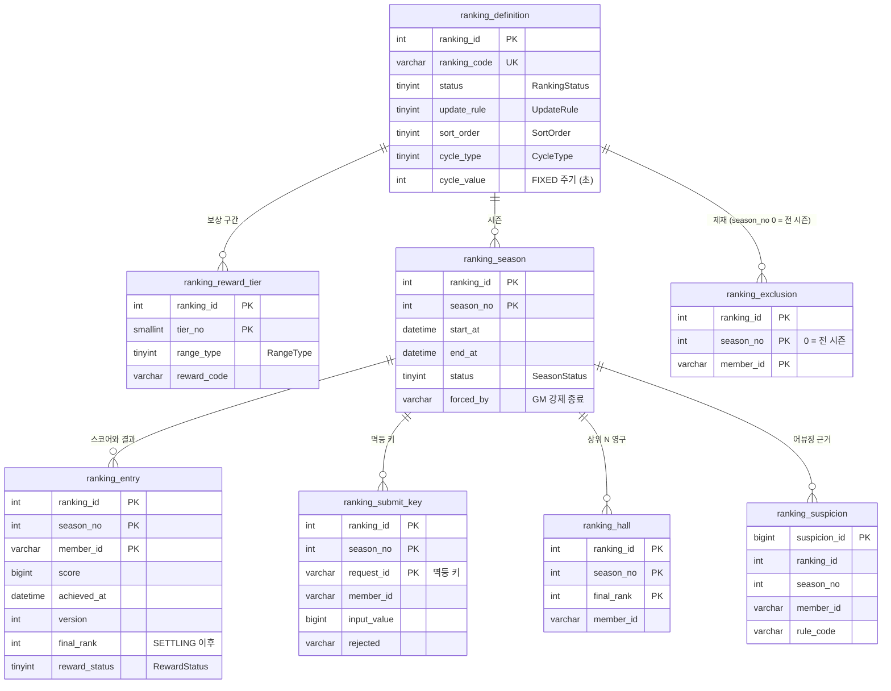
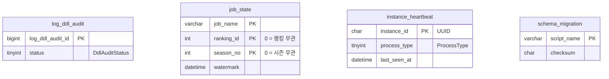
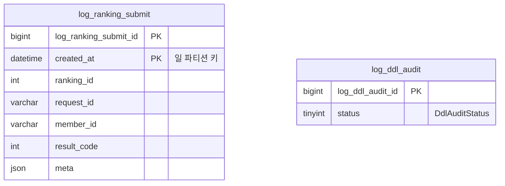
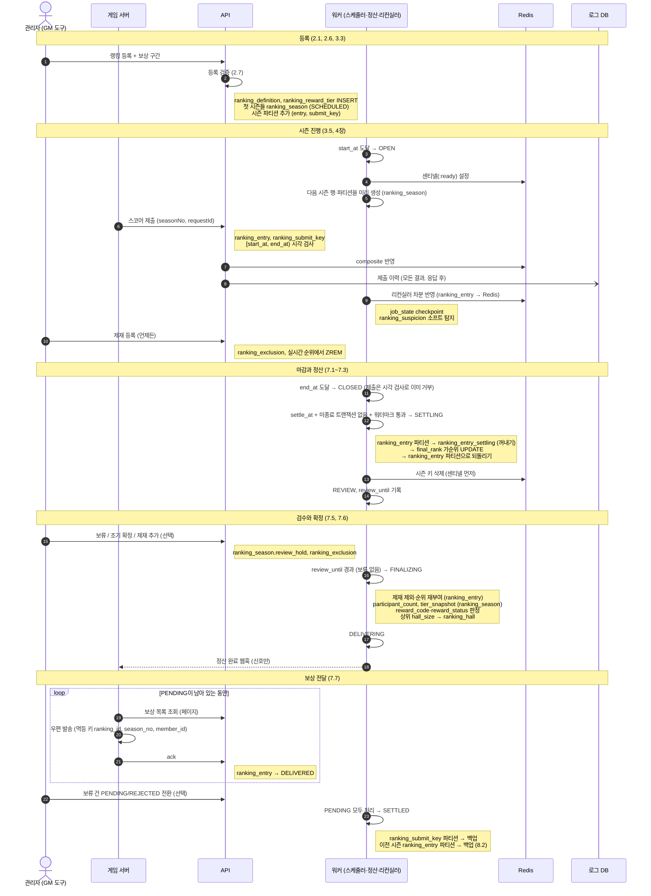
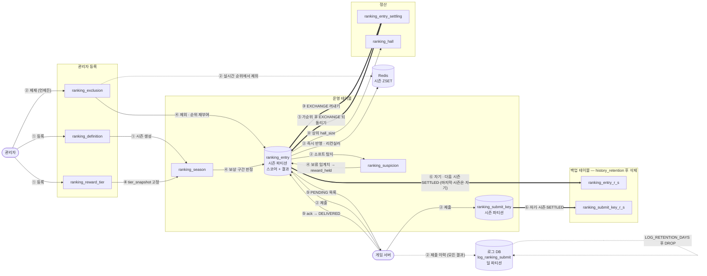
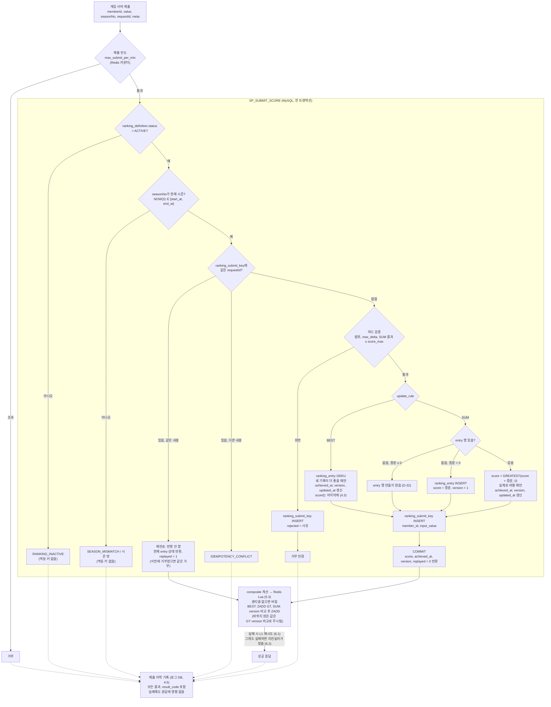

# Podium DE — 스키마

`podium_de`(메인)와 `podium_de_log`(로그 DB) 스키마의 테이블 색인과 ERD다. 컬럼 정의는 `database/tables/`, `database_log/tables/`와 [01_DESIGN](01_DESIGN.md)의 DDL이 기준이며, 이 문서는 컬럼을 반복하지 않는다. 테이블을 추가하거나 관계가 바뀌면 이 문서도 함께 고친다.

## 1. 테이블 목록

행을 만드는 주체로 나눈다. 시스템 관리 테이블 중 일부는 관리자가 특정 컬럼만 바꿀 수 있으며, "관리자 조작" 열에 적는다.

### 1.1 관리자 등록

GM 도구(관리 API)로 행을 만든다.

| 테이블 | 용도 | 파티션 | 생명주기 | 상세 |
| --- | --- | --- | --- | --- |
| `ranking_definition` | 랭킹 정의 (갱신 규칙, 정렬, 일정, 보관, 검증 설정). 순위 규칙은 등록 후 불변 | — | 영구 | [2.1](01_DESIGN.md#21-ranking_definition), [2.7](01_DESIGN.md#27-등록-검증) |
| `ranking_reward_tier` | 랭킹별 보상 구간 (순위·백분율 → `reward_code`) | — | 영구. 정산 시 `tier_snapshot`에 고정 | [2.6](01_DESIGN.md#26-보상-구간) |
| `ranking_exclusion` | 제재로 순위에서 제외할 멤버 (`season_no = 0`은 전 시즌) | — | 영구 | [7.8](01_DESIGN.md#78-제재-처리) |

### 1.2 시스템 관리

서버(제출 API, 워커 잡, 러너)가 행을 만들고 바꾼다.

| 테이블 | 용도 | 쓰는 주체 | 관리자 조작 | 파티션 | 생명주기 | 상세 |
| --- | --- | --- | --- | --- | --- | --- |
| `ranking_season` | 랭킹별 시즌 일정과 상태 | 시즌 스케줄러 (자동 생성, 상태 전이) | SCHEDULED 수정, OPEN `end_at` 변경, 검수 보류·조기 확정, DELIVERING 강제 종료 | — | 영구 | [3.1](01_DESIGN.md#31-ranking_season), [3.4](01_DESIGN.md#34-관리자-수정-범위), [7.5](01_DESIGN.md#75-review-검수), [7.7](01_DESIGN.md#77-delivering-보상-전달) |
| `ranking_entry` | 시즌별 멤버 스코어와 정산 결과(순위, 보상 상태) (운영 테이블, 랭킹 간 공유) | 제출 API, 정산 잡, 보상 ack API | 보류(held) 건을 PENDING 또는 REJECTED로 전환 | 시즌 | 자기 시즌과 다음 시즌 모두 SETTLED(마지막 시즌은 자기 시즌)에 분리 | [4.2](01_DESIGN.md#42-ranking_entry), [7.4](01_DESIGN.md#74-결과-컬럼), [7.7](01_DESIGN.md#77-delivering-보상-전달), [8.2](01_DESIGN.md#82-테이블별-생명주기) |
| `ranking_submit_key` | 제출 멱등 키 (재전송 판별, 하드 검증 거부 사유) | 제출 API | — | 시즌 | 자기 시즌 SETTLED에 분리 | [4.4](01_DESIGN.md#44-ranking_submit_key), [8.2](01_DESIGN.md#82-테이블별-생명주기) |
| `ranking_entry_settling` | 정산 작업 테이블 (entry 시즌 파티션을 꺼내 가순위를 매긴 뒤 되돌림) | 정산 잡 | — | — | 평소 비어 있음 | [7.3](01_DESIGN.md#73-settling-가순위-생성) |
| `ranking_hall` | 시즌별 상위 `hall_size` | 정산 잡 (FINALIZING) | — (지급 후 제재 시 `sanctioned`는 제재 처리가 갱신) | — | 영구 | [8.4](01_DESIGN.md#84-ranking_hall) |
| `ranking_suspicion` | 어뷰징 포인트 근거 (규칙별 가중치) | 리컨실러 (소프트 탐지) | — | — | 영구 | [9.2](01_DESIGN.md#92-소프트-탐지-받되-표시), [9.3](01_DESIGN.md#93-어뷰징-포인트) |
| `log_ddl_audit` | `SP_EXEC_DDL` 실행 감사 로그 | 관리 SP | — | — | 영구 | [11.4](01_DESIGN.md#114-운영-테이블) |
| `job_state` | 워커 잡별 워터마크 (리컨실러 checkpoint 등) | 워커 잡 | — | — | 영구 | [11.4](01_DESIGN.md#114-운영-테이블) |
| `instance_heartbeat` | 실행 중인 API·워커 인스턴스 | API·워커 하트비트 | — | — | 정상 종료 시 삭제, 1시간 경과 행 정리 | [11.4](01_DESIGN.md#114-운영-테이블) |
| `schema_migration` | 마이그레이션 적용 이력 | 러너 (테이블도 러너가 직접 생성) | — | — | 영구 | [11.5](01_DESIGN.md#115-마이그레이션) |

### 1.3 로그 DB (`podium_de_log`)

물리적으로 분리된 DB다. 장애가 서비스로 번지지 않게 메인과 떼어 둔다 (D-48). 메인 DB와 FK로 묶지 않는다.

| 테이블 | 용도 | 쓰는 주체 | 파티션 | 생명주기 | 상세 |
| --- | --- | --- | --- | --- | --- |
| `log_ranking_submit` | 모든 제출 요청의 처리 결과 이력 (감사, 어뷰징·장애 조사) | 제출 API (응답 후, 별도 풀) | 일 단위 | `LOG_RETENTION_DAYS` 후 일 파티션 DROP | [4.5](01_DESIGN.md#45-log_ranking_submit-로그-db) |
| `log_ddl_audit` | 로그 DB `SP_EXEC_DDL` 실행 감사 로그 (메인과 같은 구조) | 로그 DB 관리 SP | — | 영구 | [4.5](01_DESIGN.md#45-log_ranking_submit-로그-db), [11.4](01_DESIGN.md#114-운영-테이블) |
| `schema_migration` | 로그 DB 마이그레이션 적용 이력 | 러너 | — | 영구 | [11.5](01_DESIGN.md#115-마이그레이션) |

**메인 DB 백업 테이블**: `{원본}_r{rankingId}_s{seasonNo}` 이름의 일반 테이블이다(`ranking_entry`, `ranking_submit_key`). 시즌마다 생기며 `history_retention`이 지나면 삭제한다 ([8.3](01_DESIGN.md#83-보관-방식)). 정리가 멈추면 알린다 ([11.4](01_DESIGN.md#114-운영-테이블)).

**코드 컬럼**: 상태·구분값은 `TINYINT UNSIGNED`이고 값의 의미는 `src/codes.ts`에 있다 (D-46).

## 2. ERD

관계는 논리 관계다. FK 제약은 걸지 않는다. 파티션 테이블은 FK를 쓸 수 없고, 나머지는 키 구조를 설계에 맞췄다 (D-35). 아래는 키와 주요 컬럼만 보인다.

운영 테이블은 랭킹 데이터와 관계가 없다.

로그 DB(`podium_de_log`)는 메인 DB와 관계를 맺지 않는다. `ranking_id`, `request_id`, `member_id`는 조사용 값으로만 담는다.

## 3. 등록부터 시즌 종료까지

관리자가 랭킹을 등록한 뒤 시즌 하나가 시작되고 보상 전달까지 끝나는 순서다. 화살표 옆 괄호는 그 단계에서 쓰는 테이블이다. 상태 이름은 `SeasonStatus`, 상세는 01_DESIGN 3~7장.

- 시즌 랭킹은 "시즌 진행"부터 "보상 전달"까지가 시즌마다 반복된다. 정산은 다음 시즌과 병렬로 진행된다 (3.2).
- 영구 랭킹(`cycle_type = NONE`, `end_at` 없음)은 정산·보상·아카이브가 없다 (2.5).
- 전달이 끝나지 않으면 시즌은 DELIVERING에 남는다. 포기는 GM 강제 종료로만 한다 (7.7).

## 4. 데이터 흐름

3절의 단계를 기준으로 데이터가 어느 테이블에서 어디로 가는지 그린다. 화살표의 번호는 아래 표의 단계다. 굵은 화살표(`==>`)는 파티션 EXCHANGE로, 행 복사 없이 데이터 파일이 통째로 옮겨진다 (8.1).

| 단계 | 3절 구간 | 데이터 이동 |
| --- | --- | --- |
| ① | 등록 | 관리자 입력 → `ranking_definition`, `ranking_reward_tier`. 정의로부터 `ranking_season` 행과 시즌 파티션 생성 |
| ② | 시즌 진행 | 제출 → `ranking_entry`, `ranking_submit_key` → Redis. 모든 제출 결과는 로그 DB `log_ranking_submit`에 따로 남는다. 리컨실러가 `ranking_entry` 변경분을 Redis에 다시 맞추고 `ranking_suspicion`에 근거를 쌓는다. 제재(`ranking_exclusion`) 대상은 Redis에서 빠진다 |
| ③ | 마감과 정산 | `ranking_entry` 파티션을 `ranking_entry_settling`으로 꺼내(EXCHANGE) `final_rank` 가순위를 매기고 같은 파티션으로 되돌린다(EXCHANGE). 행 복사 없음. Redis 시즌 키 삭제 |
| ④ | 검수와 확정 | `ranking_exclusion`으로 제외·재순위, `ranking_reward_tier` → `ranking_season.tier_snapshot` → `ranking_entry.reward_code`, 어뷰징 포인트로 보류, 상위 N → `ranking_hall` |
| ⑤ | 보상 전달 | `ranking_entry` PENDING → 게임 서버 → ack로 DELIVERED |
| ⑥ | SETTLED 이후 | `ranking_submit_key`(자기 시즌 SETTLED), `ranking_entry`(자기·다음 시즌 SETTLED, 마지막 시즌은 자기 시즌) 파티션 → 백업 테이블(EXCHANGE). 백업은 `history_retention` 후 삭제 |

- Redis는 `ranking_entry`의 투영이다. 언제든 MySQL로 재구축할 수 있으므로 흐름의 끝점이 아니다 (1.5, 6.3).
- 로그 DB는 서비스 경로가 아니라서 시즌과 무관하게 날짜로 정리하며, 데이터가 찬 일 파티션을 DROP한다 (4.5).
- 운영 테이블(`ranking_entry`, `ranking_submit_key`)에서 데이터가 빠질 때는 항상 EXCHANGE를 쓴다. 데이터가 찬 파티션을 직접 DROP하지 않는다 (8.1).

## 5. 스코어 적용

4절 ②의 "제출" 한 건이 처리되는 순서다. 점선 상자 안이 `SP_SUBMIT_SCORE`이고, 상세는 01_DESIGN 2.3, 4.1~4.5, 5.3.

- **시각:** `achieved_at`, `updated_at`은 MySQL `NOW(3)`이며 세션 `time_zone`은 `+00:00`이다. 게임 서버나 Redis 시각을 쓰지 않는다 (4.1).
- **값이 그대로면 아무것도 갱신하지 않는다:** BEST에서 기록이 같거나 나쁠 때, SUM에서 0점에 음수 증분이 들어올 때는 `version`, `achieved_at`, `updated_at`이 바뀌지 않는다 (2.3). 그래서 리컨실러의 `updated_at` 스캔에도 잡히지 않는다.
- **ASC 정렬:** BEST의 "더 좋은 기록"은 더 작은 값이다 (4.3).
- **Redis 반영 실패:** 응답은 성공으로 나간다. MySQL이 원장이고, 리컨실러가 `ranking_entry.updated_at` 변경분으로 Redis를 다시 맞춘다.
- **재전송:** 재전송 응답도 현재 entry 상태를 돌려주므로 Redis 반영을 다시 시도할 수 있다. version 비교로 오래된 값은 무시된다 (D-43).
- **제출 이력:** 결과와 무관하게 모든 제출이 로그 DB에 남는다. 메인 트랜잭션과 묶지 않으며, 기록에 실패하면 앱 로그 파일에 남기고 넘어간다 (4.5, D-48).
